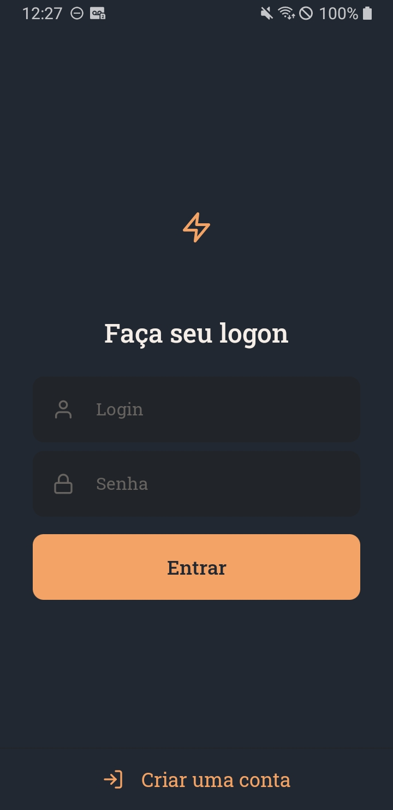
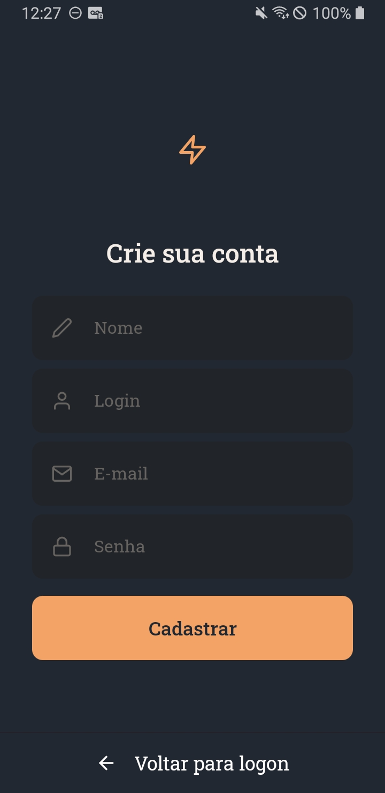
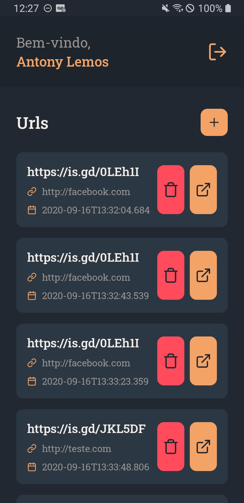
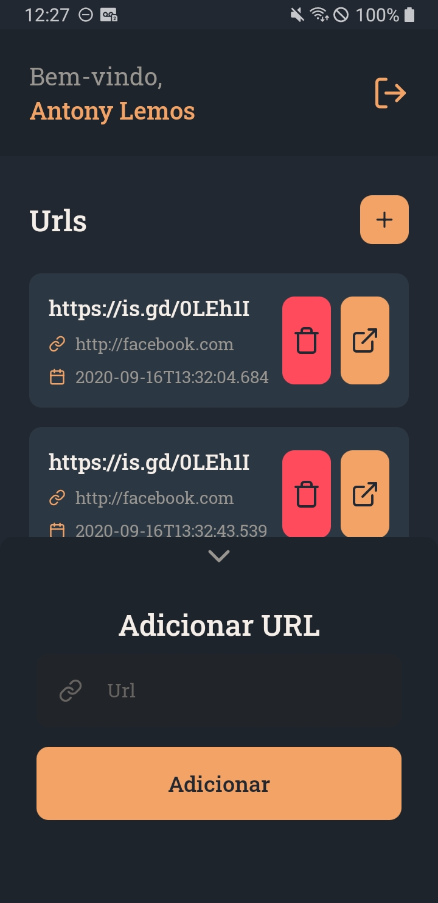

# Shorten URL ⚡

  |   |    |    |
:---------------:|:----------------:|:-----------------:|:-----------------:|

## 🏷️ Sobre

O **Shorten URL** é um aplicativo que encurta suas URLs. Faça seu cadastro, acesse sua conta e encurte quantas URLs quiser! Ah, você pode abrir elas no navegador diretamente pelo aplicativo.

## 🚀 Tecnologias utilizadas

As principais tecnologias utilizadas para a construção desse APP foram:

- [React Native](https://reactnative.dev/)
- [React Navigation](https://reactnavigation.org/)
- [styled-components](https://styled-components.com/)
- [Unform](https://unform.dev/)
- [reanimated-bottom-sheet](https://github.com/osdnk/react-native-reanimated-bottom-sheet)

## 📦 Como baixar e executar?

**Antes de baixar e executar o projeto**, é necessário configurar todo o **[Ambiente React Native](https://react-native.rocketseat.dev/)**.

### ⬇️ Baixando o projeto

Abra o terminal do seu sistema operacional e execute os seguintes comandos:

```bash
  # Clonar o repositório
  git clone https://github.com/antonylemos/shorten-url.git

  # Entrar no diretório
  cd shorten-url

  # Instalar as dependências
  yarn install
```

### 🏃 Executando o APP

Abra o terminal do seu sistema operacional e execute os seguintes comandos:

```bash
  # Executar o servidor da aplicação
  yarn start

  # Executar a aplicação
  yarn android
```

---

Desenvolvido com 💜 por Antony Lemos 🧑🏽‍🚀
